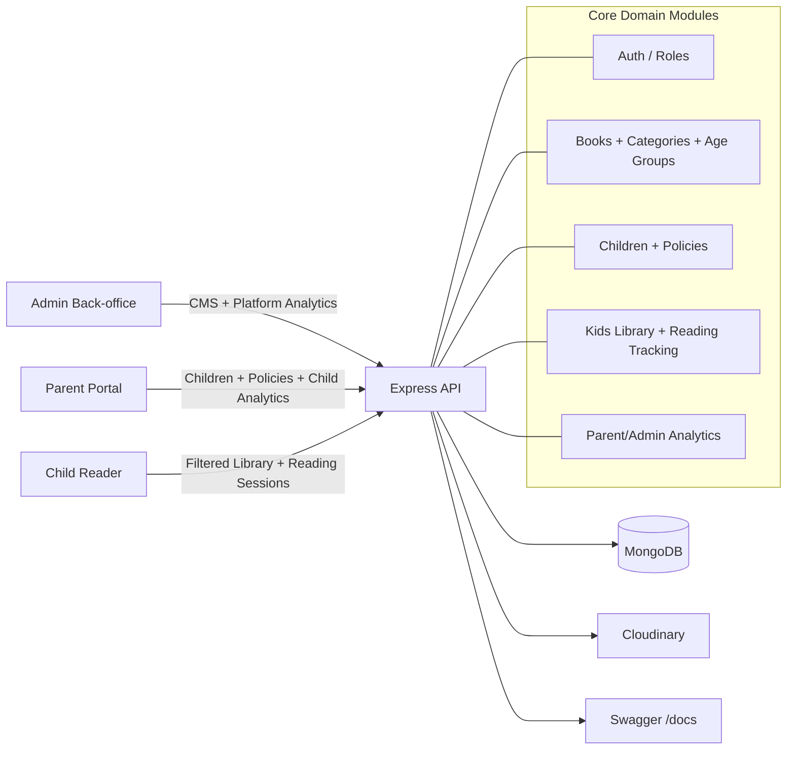

# HKids Backend Architecture

## High-Level Diagram

## Role Separation

- `ADMIN`: content management and global analytics
- `PARENT`: child profiles, permissions, limits, child analytics
- `CHILD`: restricted reading only (policy enforced server-side)

## Policy Enforcement Model

Child access is controlled by `ChildPolicy`:

- `allowedCategoryIds[]`
- `allowedAgeGroupIds[]`
- `dailyLimitMinutes`
- optional reading schedule window (`start`, `end`)

Server validates policy in `kids` endpoints before exposing books/pages or starting sessions.

## Analytics Sources

- `ReadingSession` stores session start/end, minutes, pages read, progress events.
- Parent analytics aggregates by child and date range.
- Admin analytics aggregates platform usage and top books.
